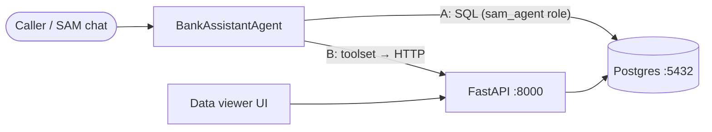

# SAM Bank Service

Mock core-banking backend for the **Bahasa Indonesia IVR Speech AI** PoC. It demonstrates how a
Solace Agent Mesh (SAM) agent gets customer data from a bank backend, and covers the three PoC intents:

1. Balance enquiry (read)
2. Recent transactions (read)
3. Card block (write, gated by identity verification)

The agent can be wired to the backend **two ways**. Both hit the same data and the same verification rule:

| Option | SAM component | Talks to |
|---|---|---|
| **A. Direct database** | PostgreSQL connector | Postgres views + `block_card()` function |
| **B. REST API** | Python toolset (`sam/toolset`) | FastAPI service → Postgres |



---

## Quick start

Needs Docker only.

```bash
docker compose up -d --build --wait
```

| What | URL |
|---|---|
| Data viewer UI | http://localhost:8000 |
| API docs (Swagger) | http://localhost:8000/docs |
| OpenAPI spec | http://localhost:8000/openapi.json |
| Postgres | `localhost:5432`, db `bank` |

Ports can be changed with `PG_PORT=5433 API_PORT=8001 docker compose up -d`.

Run the smoke test (note: it blocks card `4408` for Rina):

```bash
python tests/smoke_test.py
```

Reset all data back to the seed:

```bash
docker compose down -v
```

---

## Data model

| Table | Contents |
|---|---|
| `customers` | 8 customers: CIF, name, phone (caller ID), DOB, city, bcrypt PIN hash |
| `accounts` | 11 accounts: `TABUNGAN` / `GIRO` / `DEPOSITO`, IDR balances |
| `transactions` | ~230 transactions over the last 30 days (ATM, QRIS, transfer, PLN, etc.) |
| `cards` | 11 debit/credit cards (GPN, VISA, Mastercard), one already blocked |
| `card_block_requests` | Audit log of card blocks with reference numbers |

The agent never sees the base tables. It only gets these views:

| View | Use for |
|---|---|
| `customer_accounts` | balance enquiry |
| `account_transactions` | recent transactions |
| `customer_cards` | find the card before blocking |

and one write function, which verifies the caller before it changes anything:

```sql
SELECT * FROM block_card('<phone>', '<YYYY-MM-DD dob>', '<6-digit pin>', '<card last4>', 'LOST');
-- → success | reference | message
--   message ∈ CARD_BLOCKED, IDENTITY_VERIFICATION_FAILED, CARD_NOT_FOUND, CARD_ALREADY_BLOCKED
```

### Demo customers (fictional test data)

| Name | Phone | DOB | PIN | Cards |
|---|---|---|---|---|
| Budi Santoso | +6281234567801 | 1985-03-12 | 123456 | 4821 debit, 9034 credit |
| Siti Nurhaliza | +6281234567802 | 1990-07-25 | 234567 | 1177 |
| Agus Wijaya | +6281234567803 | 1978-11-02 | 345678 | 5520 debit, 7713 credit |
| Dewi Lestari | +6281234567804 | 1995-01-30 | 456789 | 3306 |
| Rizky Pratama | +6281234567805 | 2000-05-17 | 567890 | 6642 (blocked), 6650 |
| Putri Ayu Maharani | +6281234567806 | 1988-09-09 | 678901 | 2289 |
| Hendra Gunawan | +6281234567807 | 1972-12-21 | 789012 | 8015 (plus a dormant Giro) |
| Rina Kartika Sari | +6281234567808 | 1993-04-04 | 890123 | 4408 |

---

## REST API

| Method | Path | operationId |
|---|---|---|
| GET | `/customers/by-phone/{phone}` | `get_customer_by_phone` |
| GET | `/customers/by-phone/{phone}/accounts` | `get_balances` |
| GET | `/accounts/{account_no}/transactions?limit=5` | `get_recent_transactions` |
| GET | `/customers/by-phone/{phone}/cards` | `get_cards` |
| POST | `/cards/block` | `block_card` |

URL-encode the `+` in phone numbers (`%2B6281234567801`). Card-block errors: `401` wrong identity,
`404` card not found, `409` already blocked, `422` malformed input.

---

## Option A — Connect SAM to the database

**SAM Desktop → Builder → Connectors → Create Connector → Apps → PostgreSQL**

| Field | Value |
|---|---|
| Connector Name | `Bank Core Database` |
| Description | `Mock core banking: customer accounts, balances, transactions and cards. Read via views customer_accounts, account_transactions, customer_cards; block cards only via block_card().` |
| Database Name | `bank` |
| Database Hostname | `localhost` |
| Port | `5432` |
| Username | `sam_agent` |
| Password | `sam_agent123` |

`sam_agent` is least-privilege: SELECT on the three views plus EXECUTE on `block_card()`, and nothing else.

## Option B — Connect SAM through the REST API (toolset)

1. Zip the toolset:
   ```powershell
   Compress-Archive -Force sam/toolset/* Bank-tools-python.zip
   ```
2. **SAM Desktop → Builder → Toolsets → + Create Toolset**
   - **Name:** `bank-tools`
   - **Description:** `Bank backend tools: customer lookup, balances, recent transactions, cards and verified card block.`
   - **Tools:** upload `Bank-tools-python.zip`
3. Confirm the 5 tools show as **Ready**: `get_customer`, `get_balances`, `get_recent_transactions`, `get_cards`, `block_card`.

The toolset calls `http://localhost:8000` by default. Set the `BANK_API_URL` env var to point it somewhere else.

> If your SAM build has an **OpenAPI connector**, you can point it at `http://localhost:8000/openapi.json` instead of using the toolset. The operationIds above become the tool names.

---

## Create the agent

**SAM Desktop → Builder → Agent Management → Add Agent → Create New Agent → Create Manually**

- **Name:** `BankAssistantAgent`
- **Description:** `Bahasa Indonesia phone-banking assistant: balance enquiry, recent transactions and card blocking with identity verification.`
- **Connectors / Toolset:** `Bank Core Database` (option A) **or** the `bank-tools` toolset (option B)

<details>
<summary><strong>Instructions</strong></summary>

```
You are "Asisten Bank", a phone-banking assistant for an Indonesian bank.
Always reply in natural, polite Bahasa Indonesia (use "Bapak/Ibu"). Keep replies short —
they will be spoken aloud by a TTS engine.

The caller's phone number (caller ID) is given in the message. Use it to identify the customer.

SUPPORTED REQUESTS (nothing else — offer to transfer to a human agent otherwise):
1. Cek saldo (balance enquiry)
2. Mutasi / transaksi terakhir (recent transactions, default 5)
3. Blokir kartu (card block)

HARD RULES:
- Only state facts returned by a tool/query in THIS conversation. Never guess or invent
  balances, transactions, card numbers or reference numbers.
- Amounts are IDR. Say them in words-friendly form, e.g. "Rp 1.250.000" (satu juta dua ratus lima puluh ribu rupiah).
- Refer to cards and accounts only by their last 4 digits.
- Card block requires identity verification: ask for the caller's date of birth AND 6-digit PIN
  BEFORE calling block_card. Confirm which card (last 4 digits) and the reason (hilang/dicuri/penipuan).
- Never repeat the PIN back to the caller, and never reveal why verification failed in detail.
- If verification fails, allow one retry, then offer a human agent.
- After a successful block, read out the reference number.

IF USING THE DATABASE CONNECTOR ("Bank Core Database"):
- Query ONLY these views: customer_accounts, account_transactions, customer_cards.
- Balance:      SELECT account_no, product, balance, account_status FROM customer_accounts WHERE phone = '<PHONE>';
- Transactions: SELECT posted_at, description, amount, direction FROM account_transactions
                WHERE account_no = '<ACCOUNT_NO>' ORDER BY posted_at DESC LIMIT 5;
- Cards:        SELECT card_type, network, card_last4, card_status FROM customer_cards WHERE phone = '<PHONE>';
- Block:        SELECT * FROM block_card('<PHONE>', '<YYYY-MM-DD>', '<PIN>', '<LAST4>', '<LOST|STOLEN|SUSPECTED_FRAUD>');

IF USING THE TOOLSET ("bank-tools"):
- get_balances(phone), get_recent_transactions(account_no, limit), get_cards(phone),
  block_card(phone, date_of_birth, pin, card_last4, reason).
```

</details>

### Test prompts

```
@BankAssistantAgent [caller: +6281234567801] Halo, saya mau cek saldo tabungan saya.
```
```
@BankAssistantAgent [caller: +6281234567803] Tolong sebutin 5 transaksi terakhir di rekening tabungan saya dong.
```
```
@BankAssistantAgent [caller: +6281234567802] Kartu debit saya hilang, tolong diblokir. Tanggal lahir saya 25 Juli 1990, PIN 234567.
```
```
@BankAssistantAgent [caller: +6281234567805] Kartu saya yang 6642 tolong diblokir ya.
```
(The last one should come back as already blocked.)

Open http://localhost:8000 → **cards** / **card block requests** to confirm what the agent changed.

---

## Not included (on purpose, for now)

- **Solace event backbone.** SAM calls the backend directly here. The plan's request/reply over topics
  (`bank/account/{id}/balance/request`) comes in build step 8.
- **mTLS / API auth.** The API is unauthenticated and meant for local demos only.
