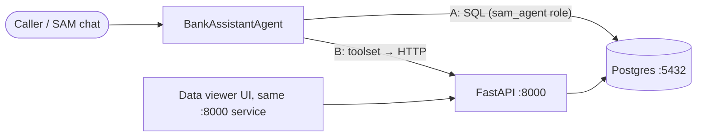

# SAM Bank Service

Mock core-banking backend for the **Bahasa Indonesia IVR Speech AI** PoC. It demonstrates how a
Solace Agent Mesh (SAM) agent gets customer data from a bank backend, and covers the three PoC intents:

1. Balance enquiry (read)
2. Recent transactions (read)
3. Card block (write, gated by identity verification)

The agent can be wired to the backend **two ways**. Both hit the same data and the same verification rule:

| Option | SAM component | Talks to |
|---|---|---|
| **A. Direct database** | PostgreSQL connector | Postgres views + `block_card()` function |
| **B. REST API** | Python toolset (`sam/toolset`) | FastAPI service → Postgres |



---

## Quick start

Needs Docker only.

```bash
docker compose up -d --build --wait
```

### What runs where

Two containers. The backend API and the frontend UI are **the same service on port 8000**: FastAPI
serves the UI page at `/` and the API routes next to it. Postgres is the only other container.

| Container | Port (host) | What it is | Credentials |
|---|---|---|---|
| `sam-bank-api` | **8000** | FastAPI backend **and** the data-viewer UI | none |
| `sam-bank-db` | **5432** | PostgreSQL 16, database `bank` | owner `bank` / `bank123`, agent `sam_agent` / `sam_agent123` |

| Open this | For |
|---|---|
| http://127.0.0.1:8000 | Data viewer UI: browse, add and delete test records |
| http://127.0.0.1:8000/docs | Swagger UI: try every API endpoint in the browser |
| http://127.0.0.1:8000/openapi.json | OpenAPI spec (for an OpenAPI connector) |
| `127.0.0.1:5432` | Postgres, for SAM's PostgreSQL connector or any SQL client |

> **Use `127.0.0.1`, not `localhost`, on Windows.** `localhost` tries IPv6 first, and Docker Desktop
> stalls about 20 seconds on it before falling back. That's slow enough to make SAM tool calls time out.

Ports can be changed with `PG_PORT=5433 API_PORT=8001 docker compose up -d`. Stop everything with
`docker compose down`.

### Adding and deleting test records

In the UI, pick a table tab:

- **+ Add record** opens a form for customers, accounts, transactions and cards. The PIN is hashed on save.
  A new transaction also changes the account balance, so balances always match the transaction history.
- **Delete** on any row removes it. Deleting a customer also deletes their accounts, cards and transactions.
  Deleting a transaction reverses its effect on the balance.
- Errors from the database (duplicate CIF, bad status value, unknown account_no, and so on) show next to the buttons.

These admin routes are for testing only. They're hidden from `/openapi.json`, so an agent wired
through an OpenAPI connector never sees them.

### Call log: what did the agent actually do?

The **call log** tab (the first tab; it refreshes every 3 seconds) shows every call the agent made,
newest first, **for both integration options in one list**:

| Source | Captured how | Shows |
|---|---|---|
| `API` | Middleware in the API writes each agent endpoint call to the `api_request_log` table | method, path, query/body, HTTP status, ms |
| `DB` | Postgres logs every statement run by the `sam_agent` login to a JSON log; the API reads it | the exact SQL the agent wrote, OK or the SQL error, ms |

So with the direct database option you can still see which queries the model wrote, including failed
ones (a wrong column name, or a denied table such as `SELECT * FROM customers`). Only `sam_agent` is
logged; the UI's own queries and the API's queries don't show up as DB rows.

PINs are shown as `******` in both sources.

> **The raw Postgres log contains PINs in plain text.** When the agent calls `block_card(...)` over the DB
> connection, the PIN is part of the SQL text. Masking happens when the log is displayed. The raw file at
> `/var/lib/postgresql/data/log/` inside the `pgdata` volume is not masked. That's acceptable for fake demo
> data, never for real customers. `docker compose down -v` deletes it.

To watch the raw statement log in a terminal instead:

```bash
docker exec sam-bank-db tail -f /var/lib/postgresql/data/log/postgresql.log
```

### Wrong-PIN lockout

`block_card()` records every identity check in `verification_attempts` (`SUCCESS`, `FAILED` or `LOCKED`).
**3 wrong attempts within 15 minutes lock that phone number.** While it's locked, even the correct PIN
returns `VERIFICATION_LOCKED` (HTTP `423`). A successful check resets the count. The lock applies to both
the API and the DB connector, because both go through the same function.

To unlock during testing, delete that phone's `FAILED` rows in the **verification attempts** tab, or wait 15 minutes.

Run the smoke test (note: it blocks card `4408` for Rina):

```bash
python tests/smoke_test.py
```

Reset all data back to the seed:

```bash
docker compose down -v
```

---

## Data model

| Table | Contents |
|---|---|
| `customers` | 8 customers: CIF, name, phone (caller ID), DOB, city, bcrypt PIN hash |
| `accounts` | 11 accounts: `TABUNGAN` / `GIRO` / `DEPOSITO`, IDR balances |
| `transactions` | ~230 transactions over the last 30 days (ATM, QRIS, transfer, PLN, etc.) |
| `cards` | 11 debit/credit cards (GPN, VISA, Mastercard), one already blocked |
| `card_block_requests` | Audit log of card blocks with reference numbers |
| `verification_attempts` | Every DOB+PIN check made by `block_card()`; drives the lockout |
| `api_request_log` | Every agent API call (shown in the call log) |

The agent never sees the base tables. It only gets these views:

| View | Use for |
|---|---|
| `customer_accounts` | balance enquiry |
| `account_transactions` | recent transactions |
| `customer_cards` | find the card before blocking |

and one write function, which verifies the caller before it changes anything:

```sql
SELECT * FROM block_card('<phone>', '<YYYY-MM-DD dob>', '<6-digit pin>', '<card last4>', 'LOST');
-- → success | reference | message
--   message ∈ CARD_BLOCKED, IDENTITY_VERIFICATION_FAILED, VERIFICATION_LOCKED, CARD_NOT_FOUND, CARD_ALREADY_BLOCKED
```

### Demo customers (fictional test data)

| Name | Phone | DOB | PIN | Cards |
|---|---|---|---|---|
| Budi Santoso | +6281234567801 | 1985-03-12 | 123456 | 4821 debit, 9034 credit |
| Siti Nurhaliza | +6281234567802 | 1990-07-25 | 234567 | 1177 |
| Agus Wijaya | +6281234567803 | 1978-11-02 | 345678 | 5520 debit, 7713 credit |
| Dewi Lestari | +6281234567804 | 1995-01-30 | 456789 | 3306 |
| Rizky Pratama | +6281234567805 | 2000-05-17 | 567890 | 6642 (blocked), 6650 |
| Putri Ayu Maharani | +6281234567806 | 1988-09-09 | 678901 | 2289 |
| Hendra Gunawan | +6281234567807 | 1972-12-21 | 789012 | 8015 (plus a dormant Giro) |
| Rina Kartika Sari | +6281234567808 | 1993-04-04 | 890123 | 4408 |

---

## API endpoints

Base URL: `http://127.0.0.1:8000`. URL-encode the `+` in phone numbers (`%2B6281234567801`).

### Agent endpoints (in the OpenAPI spec)

| Method | Path | operationId | Returns |
|---|---|---|---|
| GET | `/health` | | `{"status":"healthy"}` |
| GET | `/customers/by-phone/{phone}` | `get_customer_by_phone` | CIF, name, phone, city |
| GET | `/customers/by-phone/{phone}/accounts` | `get_balances` | accounts with balance (IDR) and status |
| GET | `/customers/by-phone/{phone}/accounts/{account_no}/transactions?limit=5` | `get_recent_transactions` | newest first; `limit` 1–50; negative amount = debit. Only the caller's own accounts: any other account number gives `404 ACCOUNT_NOT_FOUND` |
| GET | `/customers/by-phone/{phone}/cards` | `get_cards` | card type, network, last 4, status |
| POST | `/cards/block` | `block_card` | `{success, reference, message}` |

`POST /cards/block` body:

```json
{ "phone": "+6281234567802", "date_of_birth": "1990-07-25", "pin": "234567", "card_last4": "1177", "reason": "LOST" }
```

| Status | Meaning |
|---|---|
| `200` | Blocked; `reference` like `BLK-20260925-A1B2C3` |
| `401` | `IDENTITY_VERIFICATION_FAILED`: wrong DOB or PIN |
| `404` | `CUSTOMER_NOT_FOUND` / `ACCOUNT_NOT_FOUND` / `CARD_NOT_FOUND` |
| `409` | `CARD_ALREADY_BLOCKED` |
| `423` | `VERIFICATION_LOCKED`: 3 wrong attempts in 15 minutes |
| `422` | Malformed input (for example, a PIN that isn't 6 digits) |

Examples:

```bash
curl http://127.0.0.1:8000/customers/by-phone/%2B6281234567801/accounts
```
```bash
curl "http://127.0.0.1:8000/customers/by-phone/%2B6281234567801/accounts/1230000001/transactions?limit=3"
```
```bash
curl -X POST http://127.0.0.1:8000/cards/block -H "Content-Type: application/json" -d "{\"phone\":\"+6281234567802\",\"date_of_birth\":\"1990-07-25\",\"pin\":\"234567\",\"card_last4\":\"1177\"}"
```

### Admin endpoints (UI only, hidden from the OpenAPI spec)

| Method | Path | What it does |
|---|---|---|
| GET | `/` | Data viewer UI page |
| GET | `/admin/tables/{table}` | All rows of `customers`, `accounts`, `transactions`, `cards` or `card_block_requests` |
| GET | `/admin/forms` | Field list for each add-record form |
| POST | `/admin/tables/{table}` | Add a row (not `card_block_requests`); returns `{"id": …}`, or `400` with the DB error |
| DELETE | `/admin/tables/{table}/{id}` | Delete a row by id; `404` if it doesn't exist |
| GET | `/admin/logs?limit=200` | Call log: agent API calls and `sam_agent` SQL, merged, newest first |

`{table}` also accepts `verification_attempts` (view and delete).

---

## Option A — Connect SAM to the database

**SAM Desktop → Builder → Connectors → Create Connector → Apps → PostgreSQL**

| Field | Value |
|---|---|
| Connector Name | `Bank Core Database` |
| Description | `Mock core banking: customer accounts, balances, transactions and cards. Read via views customer_accounts, account_transactions, customer_cards; block cards only via block_card().` |
| Database Name | `bank` |
| Database Hostname | `127.0.0.1` |
| Port | `5432` |
| Username | `sam_agent` |
| Password | `sam_agent123` |

`sam_agent` is least-privilege: SELECT on the three views plus EXECUTE on `block_card()`, and nothing else.

### Skill: teach the agent the database

Left to itself, the agent guesses the SQL. For example, it once joined on `customer_id`, which the views don't have. The skill [`sam/skills/bank-postgres`](sam/skills/bank-postgres/SKILL.md) gives it what it needs:

- the rules: always filter by the caller's phone, query in this turn, only put validated values into SQL;
- every view's columns, types and allowed values;
- the entity relationships behind the views;
- `block_card()` and its result codes;
- a tested query for each request.

The details are in `references/schema.md` and `references/queries.md`.

With the SAM CLI, from the `sam` folder. SAM Desktop installs the CLI at `%LOCALAPPDATA%\Programs\Solace Agent Mesh\cli\sam.exe`:

```powershell
cd sam
sam skill validate bank-postgres
$env:SAM_TOOL_TARGET_OS="windows"; $env:SAM_TOOL_TARGET_ARCH="amd64"; $env:SAM_TOOL_PYTHON_VERSION="3.14"
sam skill package bank-postgres
```

This writes `sam/bank-postgres.zip` (git-ignored). Upload it in SAM (Skills → Upload skill) and add the skill to the bank agent. The skill has no bundled tools; it works with the PostgreSQL connector above.

## Option B — Connect SAM through the REST API (toolset)

1. Zip the toolset:
   ```powershell
   Compress-Archive -Force sam/toolset/* Bank-tools-python.zip
   ```
2. **SAM Desktop → Builder → Toolsets → + Create Toolset**
   - **Name:** `bank-tools`
   - **Description:** `Bank backend tools: customer lookup, balances, recent transactions, cards and verified card block.`
   - **Tools:** upload `Bank-tools-python.zip`
3. Confirm the 5 tools show as **Ready**: `get_customer`, `get_balances`, `get_recent_transactions`, `get_cards`, `block_card`.

The toolset calls `http://127.0.0.1:8000` by default. Set the `BANK_API_URL` env var to point it somewhere else.

> If your SAM build has an **OpenAPI connector**, you can point it at `http://127.0.0.1:8000/openapi.json` instead of using the toolset. The operationIds above become the tool names.

---

## Create the agent

**SAM Desktop → Builder → Agent Management → Add Agent → Create New Agent → Create Manually**

- **Name:** `BankAssistantAgent`
- **Description:** `Bahasa Indonesia phone-banking assistant: balance enquiry, recent transactions and card blocking with identity verification.`
- **Connectors / Toolset:** `Bank Core Database` (option A) **or** the `bank-tools` toolset (option B)

<details>
<summary><strong>Instructions</strong></summary>

```
You are "Asisten Bank", a phone-banking assistant for an Indonesian bank.
Always reply in natural, polite Bahasa Indonesia (use "Bapak/Ibu"). Keep replies short —
they will be spoken aloud by a TTS engine.

The caller's phone number (caller ID) is given in the message. Use it to identify the customer.

SUPPORTED REQUESTS (nothing else — offer to transfer to a human agent otherwise):
1. Cek saldo (balance enquiry)
2. Mutasi / transaksi terakhir (recent transactions, default 5)
3. Blokir kartu (card block)

HARD RULES:
- Only state facts returned by a tool/query in THIS conversation. Never guess or invent
  balances, transactions, card numbers or reference numbers.
- Amounts are IDR. Say them in words-friendly form, e.g. "Rp 1.250.000" (satu juta dua ratus lima puluh ribu rupiah).
- Refer to cards and accounts only by their last 4 digits.
- Card block requires identity verification: ask for the caller's date of birth AND 6-digit PIN
  BEFORE calling block_card. Confirm which card (last 4 digits) and the reason (hilang/dicuri/penipuan).
- Never repeat the PIN back to the caller, and never reveal why verification failed in detail.
- If verification fails, allow one retry, then offer a human agent.
- If the result is VERIFICATION_LOCKED, do not ask for the PIN again. Say that phone verification
  is temporarily locked for security and offer a human agent.
- After a successful block, read out the reference number.

IF USING THE DATABASE CONNECTOR ("Bank Core Database"):
- Query ONLY these views: customer_accounts, account_transactions, customer_cards.
- Balance:      SELECT account_no, product, balance, account_status FROM customer_accounts WHERE phone = '<PHONE>';
- Transactions: SELECT posted_at, description, amount, direction FROM account_transactions
                WHERE account_no = '<ACCOUNT_NO>' ORDER BY posted_at DESC LIMIT 5;
- Cards:        SELECT card_type, network, card_last4, card_status FROM customer_cards WHERE phone = '<PHONE>';
- Block:        SELECT * FROM block_card('<PHONE>', '<YYYY-MM-DD>', '<PIN>', '<LAST4>', '<LOST|STOLEN|SUSPECTED_FRAUD>');

IF USING THE TOOLSET ("bank-tools"):
- get_balances(phone), get_recent_transactions(account_no, limit), get_cards(phone),
  block_card(phone, date_of_birth, pin, card_last4, reason).
```

</details>

### Test prompts

```
@BankAssistantAgent [caller: +6281234567801] Halo, saya mau cek saldo tabungan saya.
```
```
@BankAssistantAgent [caller: +6281234567803] Tolong sebutin 5 transaksi terakhir di rekening tabungan saya dong.
```
```
@BankAssistantAgent [caller: +6281234567802] Kartu debit saya hilang, tolong diblokir. Tanggal lahir saya 25 Juli 1990, PIN 234567.
```
```
@BankAssistantAgent [caller: +6281234567805] Kartu saya yang 6642 tolong diblokir ya.
```
(The last one should come back as already blocked.)

Open http://127.0.0.1:8000 → **cards** / **card block requests** to confirm what the agent changed.

---

## Not included (on purpose, for now)

- **Solace event backbone.** SAM calls the backend directly here. The plan's request/reply over topics
  (`bank/account/{id}/balance/request`) comes in build step 8.
- **mTLS / API auth.** The API is unauthenticated and meant for local demos only.
