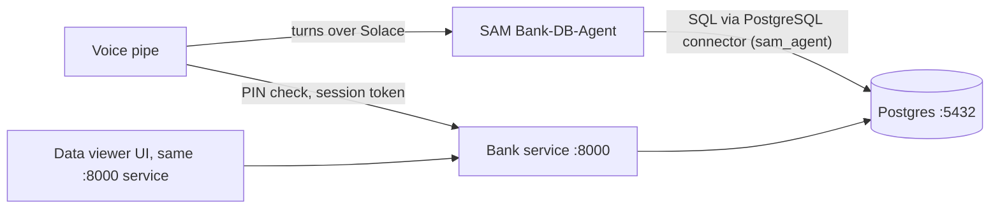

# SAM Bank Service

Mock core-banking backend for the **Indo Bank voice IVR** PoC. A Solace Agent Mesh (SAM) agent answers
verified phone callers from this database. It covers three requests:

1. **Balance enquiry** (read).
2. **Recent transactions** (read).
3. **Card block** (write). Only for a verified call, and only the caller's own card.



**Setting up SAM** (connector, skill, agent, event rule): see **[SAM_SETUP.md](SAM_SETUP.md)**.

---

## Quick start

Needs Docker only.

```bash
docker compose up -d --build --wait
```

### What runs where

Two containers. The backend API and the frontend UI are **the same service on port 8000**: FastAPI
serves the UI page at `/` and the API routes next to it. Postgres is the only other container.

| Container | Port (host) | What it is | Credentials |
|---|---|---|---|
| `sam-bank-api` | **8000** | FastAPI backend **and** the data-viewer UI | none |
| `sam-bank-db` | **5432** | PostgreSQL 16, database `bank` | owner `bank` / `bank123`, agent `sam_agent` / `sam_agent123` |

| Open this | For |
|---|---|
| http://127.0.0.1:8000 | Data viewer UI: browse, add and delete test records |
| http://127.0.0.1:8000/docs | Swagger UI: try every API endpoint in the browser |
| `127.0.0.1:5432` | Postgres, for SAM's PostgreSQL connector or any SQL client |

> **Use `127.0.0.1`, not `localhost`, on Windows.** `localhost` tries IPv6 first, and Docker Desktop
> stalls about 20 seconds on it before falling back. That's slow enough to make SAM tool calls time out.

Ports can be changed with `PG_PORT=5433 API_PORT=8001 docker compose up -d`. Stop everything with
`docker compose down`.

### Adding and deleting test records

In the UI, pick a table tab:

- **+ Add record** opens a form for customers, accounts, transactions and cards. The PIN is hashed on save.
  A new transaction also changes the account balance, so balances always match the transaction history.
- **Delete** on any row removes it. Deleting a customer also deletes their accounts, cards and transactions.
  Deleting a transaction reverses its effect on the balance.
- Errors from the database (duplicate CIF, bad status value, unknown account_no, and so on) show next to the buttons.

These admin routes are for testing only, and they're hidden from `/openapi.json`.

### Call log: what did the agent actually do?

The **call log** tab (the first tab; it refreshes every 3 seconds) shows every call the agent made,
newest first, **for both integration options in one list**:

| Source | Captured how | Shows |
|---|---|---|
| `API` | Middleware in the API writes each agent endpoint call to the `api_request_log` table | method, path, query/body, HTTP status, ms |
| `DB` | Postgres logs every statement run by the `sam_agent` login to a JSON log; the API reads it | the exact SQL the agent wrote, OK or the SQL error, ms |

So with the direct database option you can still see which queries the model wrote, including failed
ones (a wrong column name, or a denied table such as `SELECT * FROM customers`). Only `sam_agent` is
logged; the UI's own queries and the API's queries don't show up as DB rows.

PINs are shown as `******` in both sources.

> **The raw Postgres log contains PINs in plain text.** When the agent calls `block_card(...)` over the DB
> connection, the PIN is part of the SQL text. Masking happens when the log is displayed. The raw file at
> `/var/lib/postgresql/data/log/` inside the `pgdata` volume is not masked. That's acceptable for fake demo
> data, never for real customers. `docker compose down -v` deletes it.

To watch the raw statement log in a terminal instead:

```bash
docker exec sam-bank-db tail -f /var/lib/postgresql/data/log/postgresql.log
```

### Wrong-PIN lockout

`block_card()` records every identity check in `verification_attempts` (`SUCCESS`, `FAILED` or `LOCKED`).
**3 wrong attempts within 15 minutes lock that phone number.** While it's locked, even the correct PIN
returns `VERIFICATION_LOCKED` (HTTP `423`). A successful check resets the count. The lock applies to both
the API and the DB connector, because both go through the same function.

To unlock during testing, delete that phone's `FAILED` rows in the **verification attempts** tab, or wait 15 minutes.

### Verified call sessions

The voice pipe checks the caller once, at the start of the call, then hands the call to SAM:

1. `POST /ivr/sessions` `{"phone": "+6281234567801", "pin": "123456"}` checks the PIN, using the same lockout.
   - `200` returns `{"token", "full_name"}`.
   - Failures are `404 CUSTOMER_NOT_FOUND` (number not registered), `401 IDENTITY_VERIFICATION_FAILED` or `423 VERIFICATION_LOCKED`.
2. The token (64 hex characters) goes to SAM with every turn as `sessionToken`. SAM never asks for the PIN.
3. To block a card, SAM calls `block_card_verified(token, card_last4)` through the DB connector. Nothing else is asked: the caller entered their PIN at the start of the call.
   - The session decides whose cards these are, so SAM can only block the caller's own card.
4. `POST /ivr/sessions/end` `{"token": ...}` at hang-up. After that, or after 30 minutes, the token returns `SESSION_INVALID`.

These endpoints are for the voice pipe, so they're hidden from the OpenAPI spec. The **ivr sessions** tab shows each session and whether it's active. The call log shows PINs and tokens masked.

An existing database (created before this) needs the new table and functions once:

```bash
docker exec -i sam-bank-db psql -U bank -d bank < db/init/03_ivr_sessions.sql
```

Then rebuild the API: `docker compose up -d --build api`.

Run the smoke test. Note that it blocks card `4408` for Rina and a card for Agus:

```bash
python tests/smoke_test.py
```

Reset all data back to the seed:

```bash
docker compose down -v
```

---

## Data model

| Table | Contents |
|---|---|
| `customers` | 8 customers: CIF, name, phone (caller ID), DOB, city, bcrypt PIN hash |
| `accounts` | 11 accounts: `TABUNGAN` / `GIRO` / `DEPOSITO`, IDR balances |
| `transactions` | ~230 transactions over the last 30 days (ATM, QRIS, transfer, PLN, etc.) |
| `cards` | 11 debit/credit cards (GPN, VISA, Mastercard), one already blocked |
| `card_block_requests` | Audit log of card blocks with reference numbers |
| `verification_attempts` | Every DOB+PIN check made by `block_card()`; drives the lockout |
| `api_request_log` | Every agent API call (shown in the call log) |

The agent never sees the base tables. It only gets these views:

| View | Use for |
|---|---|
| `customer_accounts` | balance enquiry |
| `account_transactions` | recent transactions |
| `customer_cards` | find the card before blocking |

and one write function, which verifies the caller before it changes anything:

```sql
SELECT * FROM block_card('<phone>', '<YYYY-MM-DD dob>', '<6-digit pin>', '<card last4>', 'LOST');
-- → success | reference | message
--   message ∈ CARD_BLOCKED, IDENTITY_VERIFICATION_FAILED, VERIFICATION_LOCKED, CARD_NOT_FOUND, CARD_ALREADY_BLOCKED
```

### Demo customers (fictional test data)

| Name | Phone | DOB | PIN | Cards |
|---|---|---|---|---|
| Budi Santoso | +6281234567801 | 1985-03-12 | 123456 | 4821 debit, 9034 credit |
| Siti Nurhaliza | +6281234567802 | 1990-07-25 | 234567 | 1177 |
| Agus Wijaya | +6281234567803 | 1978-11-02 | 345678 | 5520 debit, 7713 credit |
| Dewi Lestari | +6281234567804 | 1995-01-30 | 456789 | 3306 |
| Rizky Pratama | +6281234567805 | 2000-05-17 | 567890 | 6642 (blocked), 6650 |
| Putri Ayu Maharani | +6281234567806 | 1988-09-09 | 678901 | 2289 |
| Hendra Gunawan | +6281234567807 | 1972-12-21 | 789012 | 8015 (plus a dormant Giro) |
| Rina Kartika Sari | +6281234567808 | 1993-04-04 | 890123 | 4408 |

---

## API endpoints

Base URL: `http://127.0.0.1:8000`. URL-encode the `+` in phone numbers (`%2B6281234567801`).

### Agent endpoints (in the OpenAPI spec)

| Method | Path | operationId | Returns |
|---|---|---|---|
| GET | `/health` | | `{"status":"healthy"}` |
| GET | `/customers/by-phone/{phone}` | `get_customer_by_phone` | CIF, name, phone, city |
| GET | `/customers/by-phone/{phone}/accounts` | `get_balances` | accounts with balance (IDR) and status |
| GET | `/customers/by-phone/{phone}/accounts/{account_no}/transactions?limit=5` | `get_recent_transactions` | newest first; `limit` 1–50; negative amount = debit. Only the caller's own accounts: any other account number gives `404 ACCOUNT_NOT_FOUND` |
| GET | `/customers/by-phone/{phone}/cards` | `get_cards` | card type, network, last 4, status |
| POST | `/cards/block` | `block_card` | `{success, reference, message}` |

`POST /cards/block` body:

```json
{ "phone": "+6281234567802", "date_of_birth": "1990-07-25", "pin": "234567", "card_last4": "1177", "reason": "LOST" }
```

| Status | Meaning |
|---|---|
| `200` | Blocked; `reference` like `BLK-20260925-A1B2C3` |
| `401` | `IDENTITY_VERIFICATION_FAILED`: wrong DOB or PIN |
| `404` | `CUSTOMER_NOT_FOUND` / `ACCOUNT_NOT_FOUND` / `CARD_NOT_FOUND` |
| `409` | `CARD_ALREADY_BLOCKED` |
| `423` | `VERIFICATION_LOCKED`: 3 wrong attempts in 15 minutes |
| `422` | Malformed input (for example, a PIN that isn't 6 digits) |

Examples:

```bash
curl http://127.0.0.1:8000/customers/by-phone/%2B6281234567801/accounts
```
```bash
curl "http://127.0.0.1:8000/customers/by-phone/%2B6281234567801/accounts/1230000001/transactions?limit=3"
```
```bash
curl -X POST http://127.0.0.1:8000/cards/block -H "Content-Type: application/json" -d "{\"phone\":\"+6281234567802\",\"date_of_birth\":\"1990-07-25\",\"pin\":\"234567\",\"card_last4\":\"1177\"}"
```

### Admin endpoints (UI only, hidden from the OpenAPI spec)

| Method | Path | What it does |
|---|---|---|
| GET | `/` | Data viewer UI page |
| GET | `/admin/tables/{table}` | All rows of `customers`, `accounts`, `transactions`, `cards` or `card_block_requests` |
| GET | `/admin/forms` | Field list for each add-record form |
| POST | `/admin/tables/{table}` | Add a row (not `card_block_requests`); returns `{"id": …}`, or `400` with the DB error |
| DELETE | `/admin/tables/{table}/{id}` | Delete a row by id; `404` if it doesn't exist |
| GET | `/admin/logs?limit=200` | Call log: agent API calls and `sam_agent` SQL, merged, newest first |

`{table}` also accepts `verification_attempts` (view and delete).

---

## Connect SAM

SAM reads this database directly through its **PostgreSQL connector**, logging in as `sam_agent`. That login can only read the three views and call `block_card_verified`. The `bank-postgres` skill (`sam/skills/bank-postgres`, packaged as `sam/bank-postgres.zip`) gives the agent the exact SQL.

The full step-by-step setup is in **[SAM_SETUP.md](SAM_SETUP.md)**:
1. connector settings (database, host, port, user);
2. building and uploading the skill;
3. the model's token limit;
4. the agent's details, instructions (compressed and detailed), connector, skill and toolsets;
5. the Solace event rule with its schemas;
6. how to check it works.

**Keep the skill small** (about 3 KB). SAM adds a loaded skill to the model's prompt, and Qwen's limit is 16,384 tokens for the prompt and reply together. The earlier 19.5 KB version made every voice turn fail ("context too large to compact — single oversized turn" in SAM's log). The full schema is under [Data model](#data-model).

---

## Not included (on purpose, for now)

- **REST tools for SAM.** `sam/toolset/bank_tools.py` and the agent endpoints under [API endpoints](#api-endpoints) are an alternative route that isn't used now. The current setup uses the PostgreSQL connector only.
- **mTLS / API auth.** The API is unauthenticated and meant for local demos only.

## Known issues and limits

From a code review on 2026-09-28. None of these is fixed yet.

- **Both ports are open to your whole network.** Docker publishes `8000` and `5432` on every interface, not just `127.0.0.1`. Anyone on the same Wi-Fi can:
  - read every customer through the unauthenticated API;
  - add or delete records through the admin routes;
  - log in to Postgres with the passwords in this README.

  Binding them as `127.0.0.1:8000:8000` and `127.0.0.1:5432:5432` would close that.
- **"Only the caller's data" is enforced by instructions, not by the database.** `sam_agent` can still read every customer's rows from the three views, and can still call the old `block_card(phone, dob, pin)`. The planned fix, read functions keyed by the session token (`my_accounts(token)` etc.), is deferred.
- **Registered numbers can be discovered.** `/ivr/sessions` and `GET /customers/by-phone/{phone}` answer differently for registered and unregistered numbers.
- **Old rows pile up.** `ivr_sessions` and `verification_attempts` are never cleaned up.
- **The call log over-masks.** It hides every quoted 6-digit value in SQL, which catches amounts such as `'150000'` as well as PINs.
- **The REST toolset is unused.** `sam/toolset/bank_tools.py`, `Bank-tools-python.zip` and the agent endpoints they call aren't part of the current setup. Its `block_card` still asks for the PIN, which doesn't fit the verified-call flow.
- **The smoke test changes data.** It blocks real cards every time it runs on fresh data (Rina's `4408`, Agus's cards), so re-running it leaves them blocked.
- The API opens one database connection per request.
- **Line-ending churn in the history.** Commit `5c8e7f1` rewrote whole files (`api/main.py`, `bank_tools.py`, `tests/smoke_test.py`), so their diffs show every line changed.
